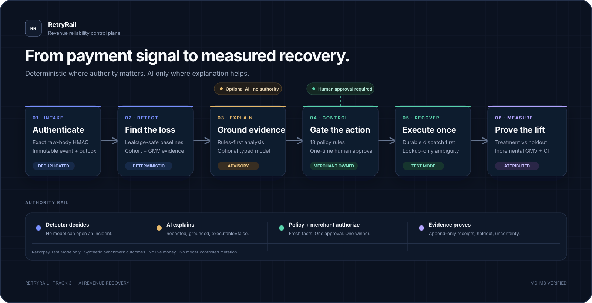
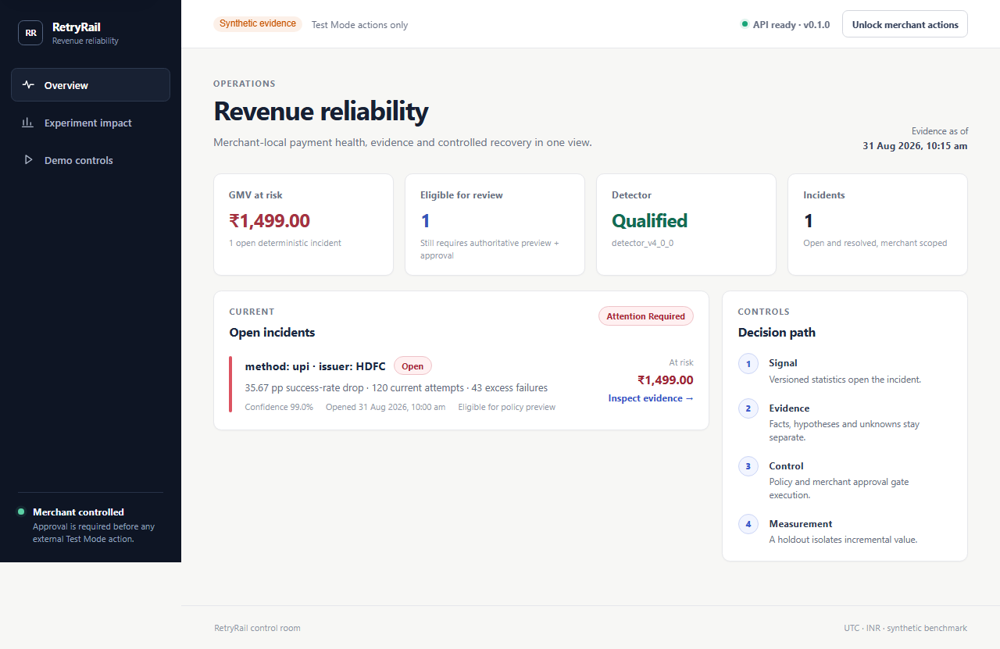
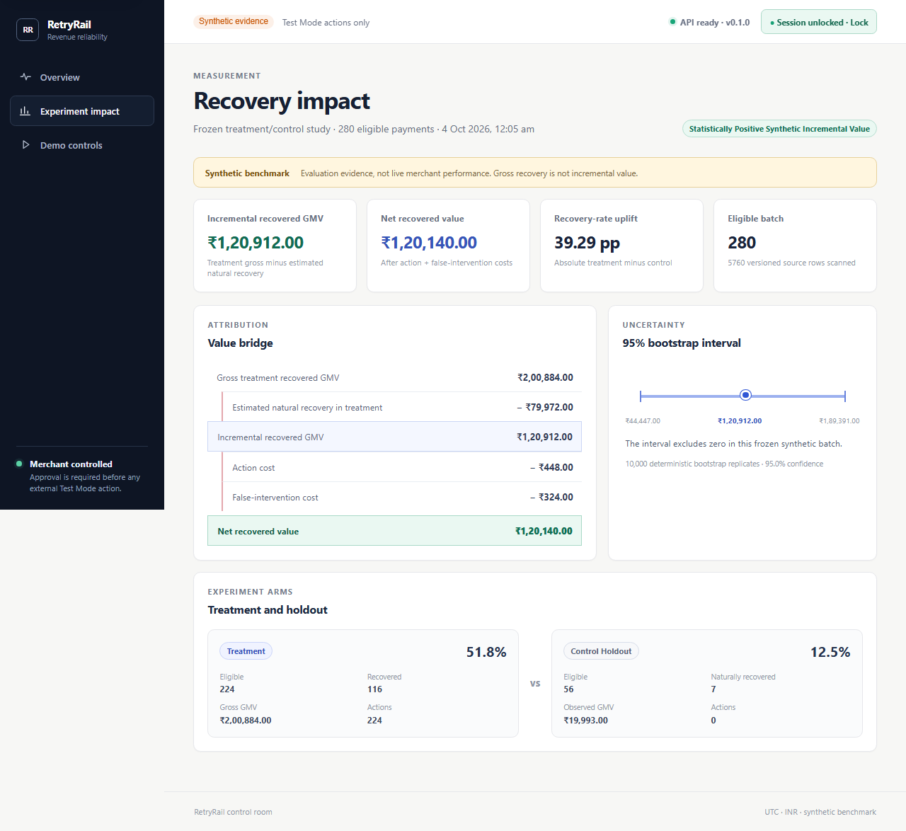
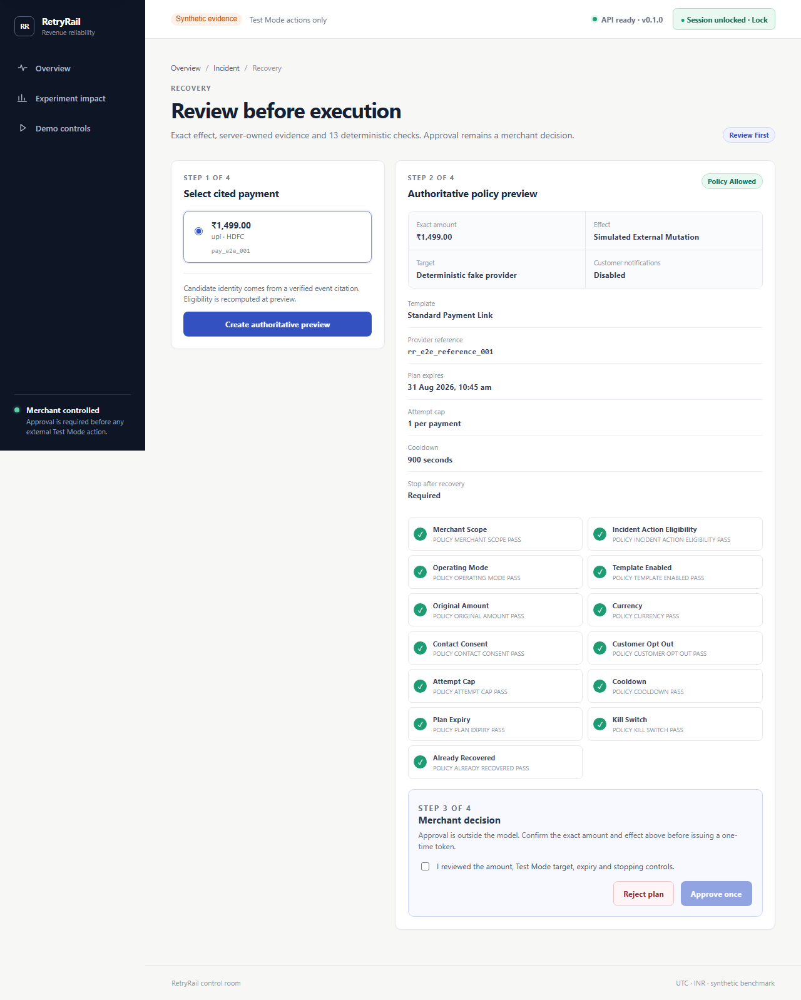
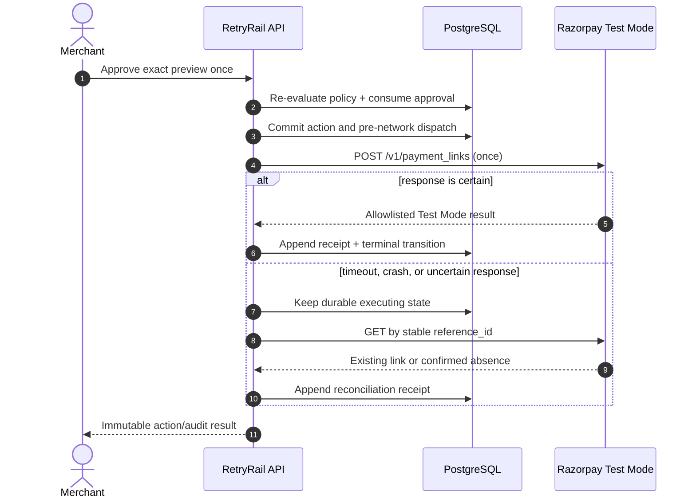

<div align="center">

# RetryRail

### Revenue reliability, closed loop.

Detect merchant-specific payment degradation, explain the evidence, recover
through a bounded Razorpay workflow, and measure the value that was actually
incremental.

[](https://github.com/abhinavrathee/RetryRail/actions/workflows/ci.yml)


[Review in 60 seconds](#review-in-60-seconds) · [See the results](#verified-results) · [Understand the architecture](#architecture) · [Run locally](#run-locally) · [Inspect the proof](#evidence-and-tests)

</div>



> **Evidence scope.** RetryRail uses Razorpay **Test Mode only**; it never moves
> real money. Detector, recovery-impact and model-evaluation results are
> versioned **synthetic benchmark evidence**, not live merchant performance. One
> human-approved Test Mode Payment Link proves the real provider boundary. It is
> not presented as live recovered revenue.

## In one view

| | |
| --- | --- |
| **Problem** | Cohort-level payment degradation can quietly reduce conversion before a merchant recognizes the pattern. |
| **Product** | A merchant control plane that closes the loop from authenticated payment events to measured recovery. |
| **Core decision** | The statistical detector—not an LLM—decides whether degradation occurred. |
| **AI role** | Optional, redacted, strict-schema explanation. Advisory only; no credentials, tools or mutation authority. |
| **Action boundary** | Thirteen deterministic policy checks plus a short-lived, single-use merchant approval. |
| **Provider** | Deterministic fake by default; protected Razorpay Test Mode Standard Payment Link adapter for external evidence. |
| **Impact method** | Frozen 80/20 treatment/control assignment, same-payment attribution and a 10,000-replicate bootstrap interval. |
| **Delivery status** | M0–M8 complete. M9 deployment package is locally verified; publication, public tag, signed-out checks and five-minute video remain. |

## Review in 60 seconds

No installation or credentials are needed to inspect the central proof:

1. **Detection** — the qualified
   [v4 blind report](evals/blind/detector_v4/runs/detector_v4_official_blind_5497598109b06d21c625/blind.report.v1.json)
   records 6 true positives, no false positives, no false negatives and a
   600-second median simulated first-signal delay.
2. **Measured value** — the
   [recovery report](evals/reports/recovery_experiment_v1.report.json) separates
   gross, natural, incremental and net value over every eligible row.
3. **Razorpay integration** — the sanitized
   [Test Mode receipt](evals/reports/razorpay_test_mode_receipt.v1.json) records
   the one POST, reference lookup, no-real-money scope and complete audit.
4. **Meaningful AI** — the
   [fixed model bakeoff](evals/reports/incident_analyst_bakeoff.v1.json) contains
   72 evaluations across grounding, abstention, privacy, injection, schema and
   trajectory behavior.
5. **Release quality** — the recorded
   [five-job CI run](https://github.com/abhinavrathee/RetryRail/actions/runs/33976562151)
   passed Python, web/build, Chromium, security/dependency and container gates.

For a strict requirement-by-requirement review, open the
[Buildathon traceability dossier](docs/BUILDATHON_REQUIREMENTS_TRACEABILITY.md).

## The product



The merchant sees operational evidence, not a chatbot transcript. The control
room exposes payment health, open incidents, GMV at risk, detector release
identity and the exact decision path. Facts, hypotheses and unknowns stay
separate all the way into recovery review.

The closed loop is:

```text
authenticated event
  → durable event + outbox
  → monotonic payment projection
  → statistical cohort detector
  → evidence-backed incident
  → deterministic brief + optional grounded model analysis
  → server-owned recovery context
  → complete 13-rule policy result
  → merchant preview and one-time approval
  → durable dispatch before network I/O
  → fake or Razorpay Test Mode execution
  → reference-only timeout reconciliation
  → append-only audit receipt
  → treatment/control outcome attribution
  → incremental recovered GMV with uncertainty
```

### What makes RetryRail different

| Evidence, not theatre | Authority, not prompt text | Incremental, not gross |
| --- | --- | --- |
| Versioned schemas, blind detector evidence, immutable receipts and held-out evaluation back every central claim. | Statistics detect. Server facts feed policy. A merchant approves. The model only explains a redacted snapshot. | A control group estimates natural recovery; gross treatment successes are never all claimed as product impact. |

## Verified results

All figures below link to their canonical machine-readable artifact.

| Result | Verified value | Evidence scope |
| --- | ---: | --- |
| Detector v4 | **6 TP · 0 FP · 0 FN** | Official synthetic blind batch |
| Precision / recall / top-1 attribution | **100% / 100% / 100%** | Synthetic benchmark, not production generalization |
| Median first-signal delay | **600 seconds** | Simulated incident clock |
| Eligible recovery batch | **280 payments · ₹500,220 GMV** | Every eligible failed incident member retained |
| Treatment / control | **224 / 56** | Frozen before outcomes; 20 balanced strata |
| Recovered treatment / control | **116 / 7** | Same-payment, 24-hour attribution |
| Absolute recovery-rate uplift | **39.29 percentage points** | Treatment minus holdout |
| Gross treatment recovered GMV | **₹200,884** | Descriptive, explicitly not causal impact |
| Incremental recovered GMV | **₹120,912** | Gross minus estimated natural recovery |
| Net recovered value | **₹120,140** | Incremental minus ₹772 modelled costs |
| 95% incremental-GMV interval | **₹44,447–₹189,391** | 10,000 deterministic bootstrap replicates |
| Test Mode provider proof | **1 × INR 1,499 link · 1 POST · HTTP 200** | Real Razorpay Test Mode; synthetic plan; no live money |
| Model evaluation | **24 cases × 3 models = 72 evaluations** | Synthetic aggregate-only safety corpus |
| Selected model | **`gpt-5.4-nano-2026-03-17`** | 95.83% grounding; every frozen gate passed |
| Unsafe model actions | **0** | Fixed M6 evaluation |
| Latest PostgreSQL CI | **514 Python tests · 85.48% branch-aware coverage** | Exact M8 evidence run |
| Frontend | **13 tests · 3 Chromium stories** | 90.05% statements; keyboard path included |



The value report is deliberately conservative in presentation. ₹200,884 is
shown as gross treatment recovery. The product claim is the ₹120,912 point
estimate after subtracting the treatment arm's estimated ₹79,972 natural
recovery. Net value then subtracts action and false-intervention costs.

## Architecture

RetryRail is a typed modular monolith with deliberately narrow authority
boundaries. Production compatibility comes from contracts, transactions and
adapters rather than infrastructure theatre.

| Plane | Responsibility | Durable proof |
| --- | --- | --- |
| Ingestion | Exact-body HMAC, bounded parsing, merchant/event deduplication | Immutable event + transactional outbox |
| Projection | Lease-based retry, dead-letter handling, out-of-order safety | Monotonic payment state |
| Detection | Leakage-safe baseline, sample/business gates, EWMA, CUSUM and attribution | Incident, observations and run receipt |
| Analysis | Rules-first brief; optional redacted strict-schema model | Snapshot-, prompt-, schema- and model-bound provenance |
| Control | Server-owned facts, 13 policy rules, one-time merchant decision | Immutable plan, policy and approval records |
| Execution | Atomic approval consumption, execute-once action, dispatch before I/O | Dispatch, provider receipt and append-only transitions |
| Measurement | Frozen assignment, same-payment outcomes, uncertainty | Assignment freeze, outcome batch and report |
| Operations | W3C trace continuation, recursive redaction, bounded metrics | Immutable trace lineage and release dashboards |

### Authority boundary

| Component | Can | Cannot |
| --- | --- | --- |
| Detector | Open and resolve incidents from merchant-local statistics | Read model output or accept a model override |
| Rules / model analyst | Explain evidence and propose one known template | Approve, mutate, call Razorpay or invent policy facts |
| Grounding validator | Reject unsupported claims, citations and scope drift | Repair authority or make output executable |
| Policy engine | Evaluate all rules against authoritative context | Perform I/O or trust client-supplied amount/consent |
| Merchant | Approve or reject the exact preview | Rebind the approval bearer to another action |
| Executor | Re-evaluate policy, consume approval and execute once | Blindly retry an uncertain create |
| Razorpay adapter | Create in Test Mode or GET by stable reference | Accept live keys, notify a customer or persist a raw response |



### Ambiguous-provider recovery

The timeout path is designed before the happy path is trusted:



There is no create retry branch. Re-entry returns the same action or performs
lookup-only reconciliation.

The full diagram and all 16 trust boundaries are documented in
[ARCHITECTURE.md](docs/ARCHITECTURE.md).

## Buildathon fit

The official [Razorpay AI Buildathon](https://razorpay.com/buildathon/) asks
builders to show a public repository, a five-minute pitch video and the
architecture. Track 3 asks for detection of revenue at risk, the right
intervention, a bounded recovery workflow, measured money recovered across a
batch, compliant escalation, stopping rules and an audit trail.

| Official Track 3 bar | RetryRail implementation | Status |
| --- | --- | --- |
| Detect revenue at risk | Statistical cohort detector, held-out metrics, GMV-at-risk evidence | Complete |
| Determine the intervention | Cited rules analysis plus optional grounded structured model | Complete |
| Execute a bounded workflow | Review-first Payment Link template, deterministic policy, one-time approval | Complete |
| Measured money across a batch | 280-row frozen treatment/control report with uncertainty | Complete; synthetic |
| Compliant escalation | Consent, opt-out, merchant scope, amount/currency and external approval checks | Complete |
| Stopping rules | Attempt cap, cooldown, expiry, already-recovered check and kill switch | Complete |
| Audit trail | Immutable source-to-terminal lineage and sanitized action receipt | Complete |
| Architecture | Branded system map, parseable tables and versioned architecture document | Complete |
| Public repository | Repository content is ready; visibility change is an M9 operator action | Pending M9 |
| Five-minute pitch | Script/checklist exist; final recording and URL | Pending M9 |

The official page specifies outputs, not a mandatory filename list. The exact
claim → implementation → artifact → verification command mapping lives in
[BUILDATHON_REQUIREMENTS_TRACEABILITY.md](docs/BUILDATHON_REQUIREMENTS_TRACEABILITY.md).

## Engineering depth

<details>
<summary><strong>Reliable webhook-to-event pipeline</strong></summary>

- Reads a bounded unmodified request body and verifies HMAC before JSON parsing.
- Uses `x-razorpay-event-id` plus merchant scope as the deduplication identity.
- Commits the immutable event and outbox intent in one database transaction.
- Claims outbox work with leases and `SKIP LOCKED`; retry is bounded and poison
  events become observable dead letters.
- Projects payment state monotonically, so delayed `authorized` events cannot
  regress an already `captured` payment.
- Keeps normalized storage allowlist-only: no raw card, VPA, contact, note,
  token or credential field enters the runtime contract.

Read [EVENT_PIPELINE.md](docs/EVENT_PIPELINE.md).

</details>

<details>
<summary><strong>Detector design and honest release history</strong></summary>

The detector evaluates five-minute merchant/cohort windows against a
leakage-safe baseline. Minimum sample, impact and statistical gates combine
with a proportion calculation, EWMA and CUSUM. Incident lifecycle rules prevent
two open incidents for one canonical cohort; attribution ranks method, issuer,
error source, step and reason contributions.

| Version | Official synthetic result | Release decision |
| --- | --- | --- |
| v1 | 0 precision / 0 recall | Blocked |
| v2 | 6 TP / 0 FP / 0 FN; 900-second delay; two baseline leaks | Blocked |
| v3 | 5 TP / 1 FP / 1 FN; required-nullable report defect | Blocked and procedurally invalid |
| v4 | 6 TP / 0 FP / 0 FN; all frozen and adversarial gates pass | Qualified |

Failed runs were preserved, not repaired after truth access. V4 recovery
eligibility is a separate hash-bound activation over the exact candidate,
report and release bytes.

Read [DETECTOR.md](docs/DETECTOR.md) and
[DETECTOR_V4_PROTOCOL.md](docs/DETECTOR_V4_PROTOCOL.md).

</details>

<details>
<summary><strong>Bounded AI analyst</strong></summary>

The deterministic rules brief is persisted before a provider request. The
optional model receives only an aggregate `IncidentSnapshot`; merchant,
payment, customer, contact, raw-event, note, token and credential values are
excluded. It has no tools and provider storage is disabled.

Output must match strict `IncidentBrief` and `RecoveryProposal` schemas, cite
known evidence, preserve merchant-local scope, choose the one allowlisted
template, include stop conditions and remain `executable=false`. Timeout,
refusal, invalid output, failed grounding or provider error falls back to the
already-valid rules result. Only one clean schema-regeneration attempt is
allowed.

The frozen evaluation covers 24 cases across grounding, abstention, privacy,
prompt injection, scope, trajectory and schema behavior for three dated models.
Raw completion prose and credentials are not retained in the report.

Read [INCIDENT_ANALYST.md](docs/INCIDENT_ANALYST.md).

</details>

<details>
<summary><strong>Policy, approval and execution</strong></summary>

The pure versioned policy evaluates every rule without short-circuiting:
merchant scope, detector eligibility, operating mode, template enablement,
original amount, currency, consent, opt-out, attempt cap, cooldown, expiry, kill
switch and already-recovered state.

Clients provide identities and idempotency keys—not money or policy facts.
RetryRail reconstructs authoritative context from locked records. A successful
preview returns a 256-bit approval bearer once and stores only its HMAC digest.
Execution rechecks mutable rules, atomically consumes one approval winner and
persists the action/dispatch before provider I/O.

Read [POLICY.md](docs/POLICY.md) and
[RECOVERY_WORKFLOW.md](docs/RECOVERY_WORKFLOW.md).

</details>

<details>
<summary><strong>Treatment/control measurement</strong></summary>

- Complete source scanned: 5,760 rows.
- Eligibility: synthetic, blind, INR, failed and an incident member.
- Assignment unit: payment ID; 224 treatment and 56 control.
- Assignment: outcome-independent SHA-256 ranks plus Hamilton apportionment over
  20 method × issuer × amount-band strata.
- Attribution: the same payment must recover within 86,400 seconds.
- Primary estimate: treatment/control recovered-value difference per eligible
  payment, scaled to treatment.
- Uncertainty: deterministic 10,000-replicate independent-arm percentile
  bootstrap at 95% confidence.
- Conclusion is inconclusive whenever the primary interval includes zero.

The protocol and assignments were pushed before outcome generation, and all
artifacts carry the structural label
`synthetic_batch_not_live_merchant_performance`.

Read [M5_EXPERIMENT_PROTOCOL.md](docs/M5_EXPERIMENT_PROTOCOL.md).

</details>

<details>
<summary><strong>Observability and security</strong></summary>

- W3C version-00 trace continuation with immutable
  event → outbox → incident → plan → action lineage.
- Recursive fail-closed log redaction for nested credentials, authorization,
  signatures, tokens, contacts, credential URLs and provider-key shapes.
- Fixed low-cardinality Prometheus labels; business identifiers never become
  metric labels.
- Digest-pinned Prometheus 3.5.5 LTS and Grafana 13.2.0 local profile with a
  provisioned six-section dashboard.
- Exact Alembic-head readiness, non-root application containers and graceful
  API/worker shutdown.
- Ruff, strict mypy, Bandit, secret/history scanning, `pip-audit`, fail-closed
  pnpm audit, production bundle budgets and immutable image checks in CI.

Read [M8_RELEASE_HARDENING.md](docs/M8_RELEASE_HARDENING.md) and
[SECURITY.md](docs/SECURITY.md).

</details>

## Evidence and tests

### Latest verified release snapshot

| Gate | Recorded result |
| --- | --- |
| Python on PostgreSQL | 514 passed in 31:42; 85.48% branch-aware coverage |
| Frontend unit/component | 13 passed; 90.05% statements / 77.69% branches / 93.69% functions / 92.40% lines |
| Browser | Primary keyboard workflow, independent keyboard rejection and offline foundation smoke passed |
| Contracts | All 23 generated schemas and deterministic data identities passed drift checks |
| M8 hardening | 17-case failure matrix and 11-case readiness/migration/trace/dashboard/audit set passed |
| Security | Ruff, strict mypy, Bandit with zero findings, secret/history scans and both dependency audits passed |
| Containers | Digest policy, builds, non-root runtime, migration/readiness and observability profile passed |
| Clean checkout | Locked install 67.82 seconds; absent v4 derived inputs reproduced; focused M8 gate 49.13 seconds; checkout remained clean |

Source: [verified M8 project snapshot](docs/PROJECT_STATUS.md#verified-m8-completion-snapshot)
and [CI run 33976562151](https://github.com/abhinavrathee/RetryRail/actions/runs/33976562151).

### Test layers

| Layer | What is tested |
| --- | --- |
| Unit/property | Money/time boundaries, parsing, redaction, policy arithmetic, model grounding, experiment math |
| Contract | Pydantic ↔ JSON Schema drift, frozen source identities, strict nullable and enum behavior |
| Integration | Webhook persistence, outbox crash recovery, projection ordering, migrations and authenticated APIs |
| Recovery adversarial | Idempotency rebinding, approval races, expiry, kill switch, provider ambiguity and lookup-only recovery |
| Evaluation | Every detector generation, freeze, blind report, experiment and model-selection invariant |
| Frontend | All required UI states, typed API failures, secret clearing and responsive behavior |
| End-to-end | Complete evidence → analysis → preview → approval/rejection → action → audit → impact → demo paths |
| Security/release | Static analysis, dependency audits, secret/history scan, container pinning, build budgets and clean checkout |

The detailed suite-by-suite catalogue—including test files, critical individual
cases, failure semantics, commands and the distinction between local, CI,
synthetic and external evidence—is in [TESTING.md](docs/TESTING.md).

Run everything:

```bash
make check
```

Run the reviewer-critical subset:

```bash
make demo
make experiment-check
make analyst-report-check
make failure-matrix
make m8-check
```

No command is represented as passing unless it was actually run. Historical
counts remain in the milestone snapshots; the table above is the latest exact
M8 remote run.

## Run locally

### Prerequisites

- Python 3.12 or 3.13 and [`uv`](https://docs.astral.sh/uv/)
- Node.js 22 and pnpm 11
- Docker with Compose
- GNU Make, or the underlying `uv` / `pnpm` commands on Windows

The default configuration is credential-free: deterministic fake provider plus
deterministic rules analyst. A Razorpay key or OpenAI key is **not** required.

```bash
git clone https://github.com/abhinavrathee/RetryRail.git
cd RetryRail
cp .env.example .env
make bootstrap
make seed
make dev
```

PowerShell users can create the local environment file with:

```powershell
Copy-Item .env.example .env
```

For the isolated local replay page, set these values only in the uncommitted
`.env`:

```dotenv
RETRYRAIL_REPLAY_ENABLED=true
RETRYRAIL_REPLAY_TOKEN=<a-long-random-local-value>
```

Replace the other `replace-with-a-random-...` placeholders before accepting
traffic outside your own machine. Never put Razorpay or OpenAI keys in a
`VITE_` variable or enter them in the browser.

| Surface | Local URL |
| --- | --- |
| Merchant control room | <http://127.0.0.1:5173> |
| API readiness | <http://127.0.0.1:8000/health/ready> |
| Development OpenAPI | <http://127.0.0.1:8000/docs> |
| API metrics | <http://127.0.0.1:8000/metrics> |
| Grafana, optional profile | <http://127.0.0.1:3000> |
| Prometheus, optional profile | <http://127.0.0.1:9090> |

```bash
docker compose --profile observability up --build -d
```

The real Test Mode receipt is already committed, so reviewers should not rerun
the external action. Authorized operators can follow the human-gated,
no-secret-in-repo process in [RAZORPAY_TEST_MODE.md](docs/RAZORPAY_TEST_MODE.md).
The OpenAI analyst is similarly optional and documented in
[INCIDENT_ANALYST.md](docs/INCIDENT_ANALYST.md).

## Reviewer deployment

RetryRail ships with a one-Blueprint Render deployment for the compiled control
room, FastAPI, dedicated outbox worker and PostgreSQL 16. The public reviewer
profile is deliberately synthetic and fail-closed: generated secrets, private
database ingress, same-origin browser calls, mandatory recovery kill switch,
deterministic provider and deterministic analyst fallback.

```text
GitHub checks pass → Render pre-deploy migration → API + UI health gate
                                             ↘ durable worker → PostgreSQL
```

The exact click path, expected cost, signed-out verification, rollback steps
and UptimeRobot `GET /health/ready` configuration are in
[DEPLOYMENT.md](docs/DEPLOYMENT.md). Razorpay and OpenAI keys are intentionally
not part of the public deployment.

## Repository map

```text
RetryRail/
├── apps/web/                  React, TypeScript and Razorpay Blade control room
├── services/api/              FastAPI API, worker, detector, policy and adapters
├── contracts/                 Versioned event, domain and analyst JSON Schemas
├── fixtures/webhooks/         Sanitized Razorpay-shaped fixtures
├── evals/
│   ├── blind/                 Append-only detector runs and access receipts
│   ├── experiments/           Protocol, assignment freeze and outcomes
│   ├── golden/                Fixed model and detector cases
│   └── reports/               Canonical machine-readable evidence
├── infra/                     Render, Prometheus, Grafana and security assets
├── docs/                      Requirements, ADRs, operations and proof dossiers
├── .github/workflows/ci.yml   Five-job release pipeline
├── AGENTS.md                  Repository contract for humans and coding agents
├── docker-compose.yml         Local application and observability topology
├── render.yaml                Judge-ready Render Blueprint
├── Makefile                   Reproducible development and release gates
└── .env.example               Safe, credential-free default configuration
```

## Status and limitations

M0–M8 are implemented. The exact code/evidence snapshot is in
[PROJECT_STATUS.md](docs/PROJECT_STATUS.md); the authoritative sequence is in
[BUILD_PLAN.md](docs/BUILD_PLAN.md).

M9 deployment infrastructure is ready; these operator-owned actions remain:

- apply the reviewed Render Blueprint and verify the assigned URL;
- capture final deployment screenshots;
- freeze and tag the submission commit;
- record and publish the five-minute pitch;
- make the repository public;
- verify every link while signed out; and
- submit the final application form.

Known limits:

- synthetic benchmark metrics do not establish production performance;
- one Test Mode link proves the integration boundary, not live conversion or
  provider throughput;
- runtime is single-merchant and uses a local shared-secret review boundary;
- production RBAC, row-level security, managed secrets, TLS/WAF, DNS, hosted
  telemetry, alert routing and multi-region operation are not implemented;
- Grafana anonymous Viewer access is loopback-only demo configuration;
- dead letters are observable but have no operator requeue API; and
- the model has no tools, memory, autonomous loop, router or action authority.

## Documentation

| Read this | For |
| --- | --- |
| [PRODUCT_REQUIREMENTS.md](docs/PRODUCT_REQUIREMENTS.md) | Scope, users, invariants and acceptance criteria |
| [BUILDATHON_REQUIREMENTS_TRACEABILITY.md](docs/BUILDATHON_REQUIREMENTS_TRACEABILITY.md) | Official requirement → proof mapping |
| [ARCHITECTURE.md](docs/ARCHITECTURE.md) | Components, decisions and trust boundaries |
| [TESTING.md](docs/TESTING.md) | Test catalogue and verification semantics |
| [DEPLOYMENT.md](docs/DEPLOYMENT.md) | Render, health monitoring and signed-out verification |
| [PROJECT_STATUS.md](docs/PROJECT_STATUS.md) | Latest verified implementation snapshot |
| [EVENT_PIPELINE.md](docs/EVENT_PIPELINE.md) | Webhook, event, outbox and replay behavior |
| [DETECTOR_V4_PROTOCOL.md](docs/DETECTOR_V4_PROTOCOL.md) | Blind procedure and qualified release |
| [POLICY.md](docs/POLICY.md) | All 13 policy rules and decisions |
| [RECOVERY_WORKFLOW.md](docs/RECOVERY_WORKFLOW.md) | Preview, approval, execution and audit |
| [RAZORPAY_TEST_MODE.md](docs/RAZORPAY_TEST_MODE.md) | Safe provider workflow and completed evidence |
| [M5_EXPERIMENT_PROTOCOL.md](docs/M5_EXPERIMENT_PROTOCOL.md) | Treatment/control design and result |
| [INCIDENT_ANALYST.md](docs/INCIDENT_ANALYST.md) | AI authority boundary and model bakeoff |
| [MERCHANT_UI.md](docs/MERCHANT_UI.md) | UI states and browser trust boundary |
| [M8_RELEASE_HARDENING.md](docs/M8_RELEASE_HARDENING.md) | Trace, metrics, redaction and failure matrix |
| [SECURITY.md](docs/SECURITY.md) | Threat model and data handling |
| [SUBMISSION_CHECKLIST.md](docs/SUBMISSION_CHECKLIST.md) | M9 publication and submission gate |

## License

RetryRail is available under the [MIT License](LICENSE). Read
[AGENTS.md](AGENTS.md) and [CONTRIBUTING.md](CONTRIBUTING.md) before changing
the repository. Frozen evidence is append-only, and credentials or real
customer data must never enter Git, logs, prompts, fixtures, screenshots or
videos.

---

<div align="center">

**Payment degradation becomes a measured, merchant-controlled recovery—not
just another alert.**

</div>
