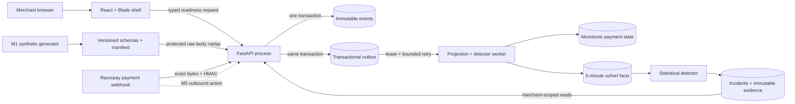

# RetryRail architecture

## Current release boundary

This document describes the implemented M0–M3 foundation, contract/data,
authenticated-event and deterministic-detector boundaries, not the complete
target system. The authoritative
product behavior remains in `PRODUCT_REQUIREMENTS.md`; sequencing remains in
`BUILD_PLAN.md`.

Solid arrows are implemented and tested. The only dashed arrow is the explicit
future outbound-action boundary. No M3 component can call Razorpay or mutate a
customer-facing payment action.

## Decisions implemented in M0–M3

- Python 3.12-compatible FastAPI modular monolith with typed Pydantic
  boundaries.
- React 18, TypeScript strict mode, Vite and Razorpay Blade for the merchant
  shell.
- Alembic-managed PostgreSQL 16 event, outbox and projection tables; SQLite is
  a hermetic local-test adapter and is rejected in production.
- One backend image reused by API and worker processes.
- Committed uv and pnpm lockfiles, pinned CI actions and explicit dependency
  build-script allowlisting.
- A versioned normalized payment-event schema generated from its Pydantic model.
- Strict contracts for incidents, recovery plans, action receipts, detector
  evaluation, delivery instructions and experiment design.
- A SHA-256-derived 2,880-attempt truth set with physically separated tuning
  and held-out labels, plus a committed manifest identity.
- Exact-body verification before parsing, bounded request allocation,
  duplicate-key rejection and allowlist-only durable storage.
- Merchant/event uniqueness plus database-level event immutability.
- Lease-based `SKIP LOCKED` outbox processing with capped retry, explicit
  dead-letter state and monotonic payment projection.
- Protected, production-disabled replay plus redacted low-cardinality metrics
  and database/migration readiness.
- A model-free method detector using leakage-safe baselines, sample and impact
  gates, a proportion test, EWMA and CUSUM.
- Exact method and method/issuer aggregate windows, frozen incident baselines,
  one-active-cohort lifecycle enforcement and append-only evidence/run receipts.
- Verified attribution facts kept separate from merchant-local hypotheses and
  unknown external provider state.
- A threshold freeze plus committed tuning and held-out reports. Detector v1
  failed held-out targets and remains explicitly release-blocked through a
  machine-readable runtime decision.

## Trust boundaries

1. Webhook bytes remain untrusted until raw-body HMAC succeeds. The HTTP route
   reads a bounded exact byte stream and does not decode JSON before
   constant-time signature verification.
2. Normalization uses an allowlist. Contact, email, VPA, notes, card and token
   fields cannot enter the normalized event contract.
3. Production configuration refuses placeholder webhook secrets, non-Postgres
   stores, enabled replay and localhost CORS origins.
4. The browser receives no credential-bearing environment variable. Only
   values prefixed `VITE_` may enter its build.
5. Detector truth labels live outside normalized runtime events, preventing
   threshold code from receiving held-out labels through the event contract.
6. Event rows reject update and delete in the database. Outbox and projection
   rows are merchant-scoped, and every processing intent has a stable
   idempotency key and durable terminal receipt.
7. Detector configuration is committed, not caller-controlled. Detection reads
   only completed authenticated events, and API reads use the configured
   merchant scope.
8. Incident observations and detector-run receipts reject update/delete in the
   database. A partial unique index prevents two open incidents for one
   merchant/cohort.
9. The detector release decision is derived from held-out targets, bound to the
   threshold artifact hash and bundled into the runtime. V1 incidents remain
   visible with at-risk evidence but are persisted as action-ineligible.
10. The future model boundary and external mutation boundary remain absent; M3
   cannot perform any payment or customer action.

## Dependency boundary

Razorpay Blade publishes one universal package with web and React Native peers.
RetryRail imports its conditional web export and intentionally ignores the
native-only peers. TypeScript remains strict for first-party code while
`skipLibCheck` isolates upstream declaration conflicts. Production build and a
real Chromium test verify the web integration.

The Blade provider is lazy-loaded: the initial JavaScript entry is capped at
200 kB, the isolated design-system chunk at 800 kB and total JavaScript at
1 MB. The production build fails if any budget is exceeded.

Blade 12.121.0 pins `ts-deepmerge` 6.2.0, affected by GHSA-87mf-gv2c-c62c.
The workspace overrides it to 8.0.0 and redirects Blade's removed default
export through a four-line compatibility module. An unsafe-key regression test,
production build and Chromium test are release gates for that adapter.

## Next architecture increment

Detector-v2 R1 precommits the remediation protocol, development batch and
nonce-derived blind generator. R2 provides a frozen hierarchical,
provider-actionability-aware candidate plus byte-reproducible development
prediction, report and source/config/matcher freeze. R3 adds a separately
hash-bound, append-only runner with create-only receipts, exclusive prediction
and scoring stages, and an explicit prediction-replay boundary before truth
access. Its official synthetic blind run is complete but release-blocked on
median detection delay and baseline leakage. Confirmed candidate incidents
remain globally action-ineligible; M4 remains behind a future qualified
release decision and cannot let a model or policy override detector
eligibility.

Detector-v3 introduced a guarded, frozen baseline and passed both approved
development partitions. Its one official synthetic blind run nevertheless
failed precision and recall, and its frozen canonical report omitted a
required nullable field for an unresolved incident. The append-only run is
preserved as blocked and procedurally invalid. An independent post-run audit
reproduces the public-nonce inputs and validates the exact failure without
altering the frozen runner or evidence. M4 therefore remains blocked behind a
future separately versioned detector release.

M3R.5 R5.1 precommitted that separate detector-v4 boundary, and R5.2
implements it. Method and method/issuer candidates use canonical-cohort state,
so a parent's state or cooldown cannot starve a passing child. Confirmed
same-method intervals form deterministic overlap components; confirmed breadth
across at least two child scopes selects a parent, otherwise a child wins, with
a stable evidence-strength tie-break. Exactly one incident is emitted and every
loser receives a typed audit disposition. The exact matcher and core evidence
gates stay unchanged. The development writer emits required nullable fields,
strictly reloads and canonicalizes the open-incident report to identical bytes.
R5.3 binds 15 adversarial cases, all development artifacts and candidate source
paths into a nonce-free candidate freeze. A separate runner freeze binds typed
append-only evidence contracts, repository-confined create-only paths,
prediction reproduction before truth authorization, redacted terminal failure
receipts, strict report read-back before completion and receipt-bound
clean-checkout reproduction after public nonce reveal. No v4 nonce or official
run exists yet; the frozen candidate remains action-ineligible and unqualified.
