# RetryRail architecture

## Current release boundary

This document describes the implemented M0–M5 foundation, provider boundary and
measurement evidence. M5's external release gate is closed by one human-approved
Test Mode execution and its committed sanitized receipt. The authoritative
product behavior remains in `PRODUCT_REQUIREMENTS.md`; sequencing remains in
`BUILD_PLAN.md`.

```mermaid
flowchart LR
    Browser[Merchant browser] --> Web[React + Blade shell]
    Web -->|typed readiness request| API[FastAPI process]
    Truth[M1 synthetic generator] --> Contracts[Versioned schemas + manifest]
    Contracts -->|protected raw-body replay| API
    Razorpay[Razorpay payment webhook] -->|exact bytes + HMAC| API
    API -->|one transaction| Events[(Immutable events)]
    API -->|same transaction| Outbox[(Transactional outbox)]
    Outbox -->|lease + bounded retry| Worker[Projection + detector worker]
    Worker --> Projection[(Monotonic payment state)]
    Worker --> Aggregates[(5-minute cohort facts)]
    Aggregates --> Detector[Statistical detector]
    Detector --> Incidents[(Incidents + immutable evidence)]
    Incidents -->|merchant-scoped reads| API
    Incidents --> Analyst[M4.5 deterministic rules analyst]
    Analyst --> BriefEvidence[(Immutable grounded briefs)]
    Incidents --> Recovery[M4 authoritative recovery workflow]
    Projection --> Recovery
    Worker --> Controls[(Synthetic recovery controls)]
    Controls --> Recovery
    RecoveryContracts[M4.1 policy + approval + action contracts] --> Policy[M4.2 pure deterministic policy]
    Recovery --> Policy
    Recovery --> PreviewEvidence[(Immutable plans + policy results)]
    Merchant[Authenticated merchant API client] -->|approve or reject| Recovery
    Recovery --> ApprovalEvidence[(Immutable decisions + consumptions)]
    ApprovalEvidence --> Executor[Execute-once coordinator]
    Policy --> Executor
    Executor --> Dispatch[(Durable pre-network dispatch)]
    Executor --> Fake[Deterministic fake provider]
    Dispatch --> Adapter[Razorpay Test Mode adapter]
    Adapter -->|one POST only| Razorpay
    Adapter -->|GET by stable reference| Razorpay
    Fake --> ProviderEvidence[(Sanitized provider receipts)]
    Adapter --> ProviderEvidence
    ProviderEvidence --> ActionEvidence[(Actions + append-only transitions)]
    ActionEvidence --> Audit[M4.5 audit completeness verifier]
    Blind[Qualified full synthetic blind batch] --> Assignment[M5 frozen stratified assignment]
    Assignment --> Outcomes[M5 attributed treatment/control outcomes]
    Outcomes --> Report[Incremental GMV + bootstrap uncertainty]
    Report -->|authenticated read only| API
```

All arrows are implemented behavior. The M4.2 evaluator remains pure. The
network adapter accepts Test Mode credentials only, carries no customer contact,
and remains unreachable until a fresh deterministic policy passes and a human
merchant approval is atomically consumed. The review workflow used that
authority once for the committed external Test Mode evidence link.

## Decisions implemented in M0–M5

- Python 3.12-compatible FastAPI modular monolith with typed Pydantic
  boundaries.
- React 18, TypeScript strict mode, Vite and Razorpay Blade for the merchant
  shell.
- Alembic-managed PostgreSQL 16 event, outbox and projection tables; SQLite is
  a hermetic local-test adapter and is rejected in production.
- One backend image reused by API and worker processes.
- Committed uv and pnpm lockfiles, pinned CI actions and explicit dependency
  build-script allowlisting.
- A versioned normalized payment-event schema generated from its Pydantic model.
- Strict contracts for incidents, recovery plans, action receipts, detector
  evaluation, delivery instructions and experiment design.
- A SHA-256-derived 2,880-attempt truth set with physically separated tuning
  and held-out labels, plus a committed manifest identity.
- Exact-body verification before parsing, bounded request allocation,
  duplicate-key rejection and allowlist-only durable storage.
- Merchant/event uniqueness plus database-level event immutability.
- Lease-based `SKIP LOCKED` outbox processing with capped retry, explicit
  dead-letter state and monotonic payment projection.
- Protected, production-disabled replay plus redacted low-cardinality metrics
  and database/migration readiness.
- A model-free method detector using leakage-safe baselines, sample and impact
  gates, a proportion test, EWMA and CUSUM.
- Exact method and method/issuer aggregate windows, frozen incident baselines,
  one-active-cohort lifecycle enforcement and append-only evidence/run receipts.
- Verified attribution facts kept separate from merchant-local hypotheses and
  unknown external provider state.
- M4.1 immutable schemas for the pre-authorized template, complete deterministic
  policy result, hashed approval lifecycle and provider-bound recovery action.
- Canonical policy-rule and action-transition ordering, actor authorization,
  typed retry/reconciliation errors and explicit side-effect classifications.
- A stateless, version-pinned policy engine that evaluates every rule without
  short-circuiting, rejects non-UTC facts and derives a deterministic result ID
  from the complete canonical context.
- A server-owned context assembler that cross-checks incident cohort evidence,
  immutable source event, payment projection and explicit recovery controls;
  callers cannot submit money, consent, eligibility or policy facts.
- Immutable, digest-bound plan, provenance, policy, merchant-decision and
  token-consumption evidence with merchant-scoped idempotency constraints.
- Constant-time single-merchant approval authentication and 256-bit approval
  bearers stored only as a separate-key HMAC digest, delivered once and consumed
  by a one-winner append-only database constraint.
- An additive activation gate that verifies the exact qualified detector-v4
  candidate, report and release bytes without rewriting any frozen artifact.
- An execute-once coordinator that revalidates all 13 policy rules, atomically
  consumes approval with the action receipt, returns exact idempotent replays and
  never retries an ambiguous provider create.
- A deterministic fake Payment Link adapter with typed success, known failure,
  timeout-before-create and timeout-after-create behavior plus lookup-only
  reconciliation by stable reference.
- A Test Mode-only Razorpay adapter that performs one bounded Standard Payment
  Link POST, admits only allowlisted response fields and uses reference-filtered
  GET for every ambiguous or crash recovery path.
- A two-transaction execution boundary: approval consumption, attempt advance,
  action and immutable dispatch commit before network I/O; the sanitized provider
  receipt commits afterward. Re-entry never repeats the POST.
- A no-model rules analyst that grounds every citation in verified merchant
  events and an audit verifier that requires the complete source-to-terminal
  action chain.
- A pre-outcome, hash-bound 80/20 treatment/control assignment over all 280
  eligible rows in the qualified synthetic blind batch, followed by same-payment
  attribution, separate gross/natural/incremental/net value, and a deterministic
  10,000-replicate bootstrap interval.
- An authenticated read-only experiment endpoint serving the exact packaged
  report only after its activated SHA-256 and strict contract validate.
- A threshold freeze plus committed tuning and held-out reports. Detector v1
  failed held-out targets and remains explicitly release-blocked through a
  machine-readable runtime decision.

## Trust boundaries

1. Webhook bytes remain untrusted until raw-body HMAC succeeds. The HTTP route
   reads a bounded exact byte stream and does not decode JSON before
   constant-time signature verification.
2. Normalization uses an allowlist. Contact, email, VPA, notes, card and token
   fields cannot enter the normalized event contract.
3. Production configuration refuses placeholder webhook secrets, non-Postgres
   stores, enabled replay and localhost CORS origins.
4. The browser receives no credential-bearing environment variable. Only
   values prefixed `VITE_` may enter its build.
5. Detector truth labels live outside normalized runtime events, preventing
   threshold code from receiving held-out labels through the event contract.
6. Event rows reject update and delete in the database. Outbox and projection
   rows are merchant-scoped, and every processing intent has a stable
   idempotency key and durable terminal receipt.
7. Detector configuration is committed, not caller-controlled. Detection reads
   only completed authenticated events, and API reads use the configured
   merchant scope.
8. Incident observations and detector-run receipts reject update/delete in the
   database. A partial unique index prevents two open incidents for one
   merchant/cohort.
9. Detector activation is additive and hash-bound to the exact qualified v4
   candidate, blind report and release decision. V1–v3 identities and forged v4
   configuration hashes remain action-ineligible; frozen evidence is unchanged.
10. M4.1 contracts describe the model, approval and external mutation
    boundaries. M4.2 evaluates only validated internal context and grants no
    merchant approval.
11. M4 rebuilds policy facts from server records, returns an approval bearer
    once, stores only its keyed digest, and couples its single consumption to a
    fresh execution policy and immutable action.
12. The M5 provider boundary rejects live keys and redirects, forces
    notifications/reminders off, never stores credentials or raw provider
    responses, and persists an immutable request digest before any Test Mode
    network I/O. An uncertain create can proceed only to reference lookup.
13. M5 assignment and outcome namespaces are independent. Protocol and
    assignment were committed remotely before outcomes, all eligible rows are
    retained, and every report remains structurally labelled synthetic.

## Dependency boundary

Razorpay Blade publishes one universal package with web and React Native peers.
RetryRail imports its conditional web export and intentionally ignores the
native-only peers. TypeScript remains strict for first-party code while
`skipLibCheck` isolates upstream declaration conflicts. Production build and a
real Chromium test verify the web integration.

The Blade provider is lazy-loaded: the initial JavaScript entry is capped at
200 kB, the isolated design-system chunk at 800 kB and total JavaScript at
1 MB. The production build fails if any budget is exceeded.

Blade 12.121.0 pins `ts-deepmerge` 6.2.0, affected by GHSA-87mf-gv2c-c62c.
The workspace overrides it to 8.0.0 and redirects Blade's removed default
export through a four-line compatibility module. An unsafe-key regression test,
production build and Chromium test are release gates for that adapter.

## Delivery evolution

Detector-v2 R1 precommits the remediation protocol, development batch and
nonce-derived blind generator. R2 provides a frozen hierarchical,
provider-actionability-aware candidate plus byte-reproducible development
prediction, report and source/config/matcher freeze. R3 adds a separately
hash-bound, append-only runner with create-only receipts, exclusive prediction
and scoring stages, and an explicit prediction-replay boundary before truth
access. Its official synthetic blind run is complete but release-blocked on
median detection delay and baseline leakage. Confirmed candidate incidents
remain globally action-ineligible; M4 remains behind a future qualified
release decision and cannot let a model or policy override detector
eligibility.

Detector-v3 introduced a guarded, frozen baseline and passed both approved
development partitions. Its one official synthetic blind run nevertheless
failed precision and recall, and its frozen canonical report omitted a
required nullable field for an unresolved incident. The append-only run is
preserved as blocked and procedurally invalid. An independent post-run audit
reproduces the public-nonce inputs and validates the exact failure without
altering the frozen runner or evidence. M4 therefore remains blocked behind a
future separately versioned detector release.

M3R.5 R5.1 precommitted that separate detector-v4 boundary, and R5.2
implements it. Method and method/issuer candidates use canonical-cohort state,
so a parent's state or cooldown cannot starve a passing child. Confirmed
same-method intervals form deterministic overlap components; confirmed breadth
across at least two child scopes selects a parent, otherwise a child wins, with
a stable evidence-strength tie-break. Exactly one incident is emitted and every
loser receives a typed audit disposition. The exact matcher and core evidence
gates stay unchanged. The development writer emits required nullable fields,
strictly reloads and canonicalizes the open-incident report to identical bytes.
R5.3 binds 15 adversarial cases, all development artifacts and candidate source
paths into a nonce-free candidate freeze. A separate runner freeze binds typed
append-only evidence contracts, repository-confined create-only paths,
prediction reproduction before truth authorization, redacted terminal failure
receipts, strict report read-back before completion and receipt-bound
clean-checkout reproduction after public nonce reveal. No v4 nonce or official
run existed in that freeze. R5.4 later consumed one public-nonce synthetic blind
slot. Its prediction-only commit precedes truth authorization, exact prediction
reproduction and the terminal report in history. The run passes every unchanged
detector target and strict serialization check. R5.5 then passed working-tree,
clean-checkout, security, container-runtime and remote CI gates. At that
checkpoint its release decision permitted M4 integration work while runtime
actions correctly remained disabled until deterministic policy and external
approval were implemented.

M4.1 now preserves the original M1 plan and receipt schemas and adds separately
versioned recovery-template, policy-result, approval-record and recovery-action
contracts. ADR-0007 records their side effects and threat model. The only
template preserves amount, disables notifications, requires merchant approval
and has no production target. Policy results cannot omit or hide a deny rule;
approval records cannot contain the raw bearer; action transitions require the
correct actor and target.

M4.2 implements `deterministic_policy_v1_0_0` as a pure evaluator over those
contracts. It records every rule result in canonical order, permits an aggregate
allow only in `REVIEW_FIRST` when all 13 rules pass, treats exact expiry as
denied, and permits exact cooldown completion. Identical contexts produce the
same content-addressed result identifier. The engine itself still does not
assemble facts or persist results.

M4.3 wraps that engine in a separate authoritative workflow. It admits only
incident/payment/idempotency identities from the caller, locks and cross-checks
the source records, persists canonical plan/provenance/policy documents, and
records one authenticated merchant decision. Approval credentials are random,
short-lived, hash-only at rest and represented as an immutable decision plus a
separate unique consumption fact. See ADR-0008 and `RECOVERY_WORKFLOW.md`.

M4.4 adds the execute-once boundary. It locks the plan and approval, rebuilds
current authoritative policy facts, persists a distinct execution-stage result
and stops before provider access on any denial. On allow, token consumption,
the action and initial transitions are one transaction. The deterministic fake
uses a stable reference, never sends a notification and converts uncertainty to
`reconciliation_required`; follow-up performs lookup only, never another create.

M4.5 adds the model-unavailable path and release proof. The rules analyst
validates statistics, diagnosis, cohort and every cited verified event before
persisting a content-addressed brief. The audit verifier requires source,
incident, pre-action brief, plan, both policy stages, merchant authority,
consumption, terminal provider evidence and bounded attempt control. ADR-0009
records the qualified-detector activation and fake-only transaction boundary.

M5 replaces only the provider edge. ADR-0010 records the immutable dispatch and
sanitized receipt tables plus the no-retry Test Mode adapter. An interrupted
`executing` action is resumable only through reference lookup. ADR-0011 records
the outcome-free protocol/assignment freeze and the later synthetic impact
stage. The official report separates ₹200,884 gross treatment recovery from
₹120,912 estimated incremental recovered GMV and includes its 95% bootstrap
interval. The human-approved Test Mode POST created one link; a small positive
provider-clock skew interrupted local result parsing, and the durable
`executing` action completed by reference-only GET without repeating create.
Its sanitized, complete-audit receipt closes the M5 external exit gate.
