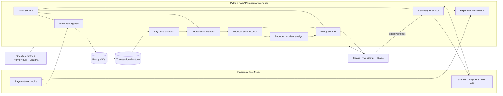

# RetryRail architecture and build plan

| Field | Value |
| --- | --- |
| Plan type | Execution-ready implementation plan |
| Baseline | 7 focused build days for a two-person team |
| Solo adjustment | Preserve order; use 9–10 days or remove all P1/P2 work |
| Release strategy | Vertical slice first, reliability and evidence before polish |
| Source of truth | `docs/PRODUCT_REQUIREMENTS.md` |

## 1. Delivery principle

The build must optimize for the signal Razorpay requests:

- A real agentic loop, not a mock chat interface.
- Working Razorpay Test Mode integration.
- Measured recovered money across a batch.
- Bounded and gated money-related actions.
- Stopping rules and compliant escalation.
- A visible audit trail.
- Honest failures, exceptions and technical obstacles.
- A public repository a reviewer can understand and run.

The critical implementation order is therefore:

```text
contracts
  -> deterministic data
  -> reliable ingestion
  -> detector and diagnosis
  -> policy-safe action
  -> experiment measurement
  -> bounded AI explanation
  -> merchant UI
  -> hardening
  -> pitch
```

The LLM and visual polish do not begin the critical path. The deterministic
product loop must work first.

## 2. Target architecture



### 2.1 Trust boundaries

1. **Untrusted event boundary:** webhook bodies are untrusted until signature
   verification succeeds.
2. **Merchant data boundary:** every record and query is scoped to a merchant.
3. **Model boundary:** only an allowlisted, redacted incident snapshot crosses
   into the model provider.
4. **Mutation boundary:** the model cannot access credentials or execute the
   Razorpay client.
5. **Approval boundary:** consequential execution requires a server-issued
   approval token generated outside the model.
6. **External-action boundary:** the executor revalidates policy and
   idempotency immediately before calling Razorpay.

## 3. Technology baseline

### 3.1 Web application

| Choice | Purpose | Reason |
| --- | --- | --- |
| Node.js 22 LTS | Frontend runtime/tooling | Current app baseline; Blade declares Node >=20 |
| React 18.2 | Merchant interface | Conservative compatibility with Razorpay Blade |
| TypeScript strict mode | UI correctness | Typed contracts and maintainable integration boundaries |
| Vite | Development and build | Fast, simple SPA toolchain reflected in Blade's public scaffold |
| `@razorpay/blade` | Components and visual language | Direct public Razorpay design-system alignment |
| TanStack Query | Server state | Explicit loading, retry and cache behavior |
| React Router | Application routing | Lightweight multi-view dashboard navigation |
| Zod | Boundary validation | Runtime validation of generated API types where needed |
| Vitest + Testing Library | Unit/component tests | Fast developer feedback |
| Playwright | End-to-end tests | Required proof of real browser behavior and failure states |

Use Razorpay's public Blade MCP only as a development aid for component
documentation. It must not become a runtime dependency or a substitute for
accessibility review.

### 3.2 Backend and analytics

| Choice | Purpose | Reason |
| --- | --- | --- |
| Python 3.12 | Backend runtime | Razorpay-aligned, stable and strong for API plus ML work |
| FastAPI | HTTP API | Typed OpenAPI, async I/O and fast development |
| Pydantic 2 | Boundary and tool schemas | Shared validation and structured agent output |
| SQLAlchemy 2 + Alembic | Persistence and migrations | Explicit transaction handling and reproducible schemas |
| PostgreSQL 16 | Event, workflow and audit store | ACID behavior, JSONB and enough analytical power for the batch |
| `asyncpg` | PostgreSQL driver | Async FastAPI/worker access |
| NumPy + SciPy | Statistical primitives | Transparent detection and confidence calculations |
| scikit-learn | Evaluation and optional calibrated models | Mature metrics and held-out evaluation tooling |
| Razorpay Python SDK + `httpx` | Razorpay integration | Official SDK behavior plus explicit HTTP control where needed |
| `structlog` | Structured logs | Redacted, correlation-friendly evidence |
| OpenTelemetry | Traces and metrics | Vendor-neutral observability boundaries |

Do not add pandas to online request handling. It may be used by offline
evaluation scripts if it materially simplifies reporting.

### 3.3 Workflow strategy

Use a PostgreSQL transactional outbox and a dedicated worker process in the
same codebase.

The worker claims jobs with row locking such as `FOR UPDATE SKIP LOCKED`, sets
bounded retries and uses explicit dead-letter status. This provides a credible
reliability story without adding a second infrastructure system.

Define an `EventBus` protocol from the beginning so a future Kafka/Kinesis
adapter does not change domain behavior.

### 3.4 AI strategy

Define a model-neutral interface:

```python
class IncidentAnalyst(Protocol):
    async def explain(self, snapshot: IncidentSnapshot) -> IncidentBrief: ...
    async def propose(self, snapshot: IncidentSnapshot) -> RecoveryProposal: ...
```

Implement:

- `ProviderIncidentAnalyst`: one bounded structured-output model adapter behind
  the protocol, selected by the M6 golden-set bakeoff.
- `RulesIncidentAnalyst`: deterministic fallback used by tests and outages.

Do not select a model because its brand appears adjacent to Razorpay. Compare
the models available to the team on schema validity, evidence grounding,
abstention, latency and cost; freeze one for the submission. The domain remains
provider-neutral so the adapter can later target Agent Studio or an approved
internal model proxy.

Do not introduce LangChain, a multi-agent framework, vector retrieval or model
memory unless a proven P0 requirement cannot be satisfied without it.

### 3.5 Deployment

For development and judging:

- Docker Compose
- API container
- Worker container from the same image
- Web container or Vite development server
- PostgreSQL container
- Prometheus and Grafana optional profile

For the production-integration story:

- Container image -> AWS ECS/Fargate or Razorpay's internal runtime
- PostgreSQL -> RDS or internal state store
- Outbox publisher -> Kafka/Kinesis/internal event gateway
- Environment secrets -> AWS Secrets Manager/internal secret service
- Model adapter -> Agent Studio or approved internal model proxy

Do not spend the core schedule building EKS or Helm deployment.

### 3.6 Why this stack fits Razorpay

This plan uses public company signals and does not pretend to know Razorpay's
private architecture:

| Public Razorpay signal | Design response |
| --- | --- |
| Track 3 asks for detection, intervention, bounded execution and measured recovery | The architecture is a complete event-to-action-to-impact loop rather than an alert or chatbot |
| Razorpay's public FDE role asks for Python plus Java, Go or TypeScript and emphasizes APIs, webhooks, integrations, cloud and distributed systems | Python owns analytics/API work; TypeScript owns the UI; explicit event, retry and adapter contracts preserve a later service split |
| Blade is Razorpay's public React design system; its package declares Node >=20 and React >=18, and its repository uses React 18.2 and Vite | The UI uses Node 22 LTS, React 18.2, Vite and `@razorpay/blade` |
| Razorpay's Agent Ready article describes repository instructions, context, testing, CI/CD and an MCP gateway | The repository starts with `AGENTS.md`, executable release contracts, versioned tool schemas and CI evidence; MCP remains an optional P1 boundary |
| Razorpay's AI Playbook emphasizes golden sets, adversarial evaluation and outcome/trajectory checks | Detector and agent evaluations are release artifacts, not screenshots or cherry-picked prompts |
| Agent Studio's published principles emphasize merchant control, first-party data, policy, consent, review and audit | The model is separated from credentials and execution by redaction, deterministic policy, external approval, idempotency and audit boundaries |

Primary public signals:

- <https://razorpay.com/buildathon/>
- <https://job-boards.greenhouse.io/razorpaysoftwareprivatelimited/jobs/4723067005>
- <https://github.com/razorpay/blade/blob/master/packages/blade/package.json>
- <https://razorpay.com/blog/razorpay-engineers-built-slash-slash-builds-the-rest/>
- <https://github.com/razorpay/ai-playbook>
- <https://razorpay.com/blog/?p=26508>

## 4. Planned repository structure

```text
RetryRail/
├── AGENTS.md
├── CLAUDE.md                  # short pointer to AGENTS.md, if needed
├── README.md
├── LICENSE
├── Makefile
├── docker-compose.yml
├── .env.example
├── pyproject.toml
├── uv.lock
├── package.json
├── pnpm-lock.yaml
├── apps/
│   └── web/
│       ├── src/
│       │   ├── api/
│       │   ├── components/
│       │   ├── features/
│       │   │   ├── overview/
│       │   │   ├── incidents/
│       │   │   ├── recovery/
│       │   │   ├── experiments/
│       │   │   └── audit/
│       │   └── routes/
│       └── tests/
├── services/
│   └── api/
│       ├── app/
│       │   ├── api/
│       │   ├── webhooks/
│       │   ├── events/
│       │   ├── payments/
│       │   ├── detector/
│       │   ├── incidents/
│       │   ├── agent/
│       │   ├── policy/
│       │   ├── recovery/
│       │   ├── experiments/
│       │   ├── audit/
│       │   └── observability/
│       ├── migrations/
│       └── tests/
├── contracts/
│   ├── events/
│   └── tools/
├── fixtures/
│   └── webhooks/
├── evals/
│   ├── golden/
│   ├── adversarial/
│   └── reports/
├── docs/
│   ├── PRODUCT_REQUIREMENTS.md
│   ├── BUILD_PLAN.md
│   ├── SUBMISSION_CHECKLIST.md
│   ├── ARCHITECTURE.md
│   ├── EVALUATION.md
│   ├── SECURITY.md
│   └── adr/
├── infra/
│   ├── prometheus/
│   └── grafana/
└── .github/
    └── workflows/
```

Only create directories when their first real file is added. Avoid empty
scaffolding that makes the repository look larger without adding evidence.

## 5. Architecture decisions to record

Create these short ADRs as their implementations land:

| ADR | Decision |
| --- | --- |
| ADR-0001 | Use a modular monolith for the Buildathon |
| ADR-0002 | Use PostgreSQL event log and transactional outbox |
| ADR-0003 | Keep statistical detection outside the LLM |
| ADR-0004 | Require preview, external approval, execute-once and verification |
| ADR-0005 | Measure impact through deterministic treatment/control assignment |
| ADR-0006 | Use Razorpay Standard Payment Links as the P0 recovery action |
| ADR-0007 | Redact model inputs through an allowlist |

Each ADR should contain context, decision, alternatives, consequences and the
condition that would justify revisiting it.

## 6. Milestone plan

The estimates are engineering hours, not elapsed clock time. They include the
tests required to pass each exit gate.

### M0 — Repository and release skeleton

**Estimate:** 3–4 hours  
**Objective:** a clean checkout can install, start and validate the skeleton.

Tasks:

- Add license, contribution notes and environment template.
- Initialize Python with `uv` and frontend with pnpm.
- Configure `ruff`, type checking, pytest, ESLint, TypeScript strict mode,
  Vitest and Playwright.
- Create a Makefile with `bootstrap`, `dev`, `seed`, `demo` and `check` targets.
- Add Docker Compose for API, worker, web and PostgreSQL.
- Add health endpoints and a placeholder Blade shell.
- Add GitHub Actions for lint, typecheck and tests.
- Add root and scoped agent-context files only where they carry real guidance.

Exit gate:

- Fresh checkout starts successfully from documented commands.
- CI passes without skipped or pretend test commands.
- No secrets are committed.

### M1 — Contracts and deterministic truth set

**Estimate:** 6–8 hours  
**Objective:** freeze what events, incidents, plans, actions and evaluations
mean before implementing behavior.

Tasks:

- Define the versioned normalized payment-event envelope.
- Add sanitized `payment.failed`, `payment.authorized` and `payment.captured`
  fixtures.
- Define Pydantic domain models and JSON Schemas.
- Create the deterministic synthetic generator and seed manifest.
- Generate normal traffic, three true incidents and one hard negative.
- Add duplicate, delayed, invalid-signature and out-of-order delivery cases.
- Split tuning and held-out detector datasets.
- Define experiment eligibility and outcome generation before running results.

Exit gate:

- One command regenerates byte-for-byte equivalent normalized data or a stable
  manifest hash.
- Ground truth is reviewable without reading generator implementation.
- No real PII or credentials appear in fixtures.

### M2 — Reliable webhook-to-event pipeline

**Estimate:** 7–9 hours  
**Objective:** events are authenticated, durable, replayable and safe under
duplicate/out-of-order delivery.

Tasks:

- Implement raw-body webhook signature verification.
- Store immutable sanitized and normalized event forms.
- Add unique merchant/event constraint.
- Write outbox rows in the same transaction.
- Implement worker claim, bounded retry and dead-letter behavior.
- Build the payment-state projector with monotonic/event-aware transitions.
- Add replay CLI/API used by the demo.
- Emit ingestion, duplication, lag and worker metrics.

Required failure tests:

- Invalid signature.
- Modified body after signing.
- Same event delivered three times.
- Worker crashes after event commit.
- Captured event delivered before authorized.
- Poison event reaches dead-letter state without blocking the stream.

Exit gate:

- Exactly one logical event and processing chain survive triple replay.
- No acknowledged event is lost in the controlled crash test.
- Projected states reconcile with fixture expectations.

### M3 — Detector, diagnosis and incident lifecycle

**Estimate:** 9–12 hours  
**Objective:** open and resolve evidence-backed incidents with honest held-out
performance.

Tasks:

- Build rolling aggregate tables or queries.
- Implement baseline construction with leakage checks.
- Implement minimum sample and business-impact gates.
- Implement EWMA/CUSUM and a proportion-confidence calculation.
- Merge repeated signals into one active incident.
- Add healthy-window incident resolution.
- Compute excess failures and at-risk GMV.
- Rank method, issuer, source, step and reason contributions.
- Produce detector and root-cause reports on tuning data.
- Freeze thresholds, then run once on the held-out test set.

Exit gate:

- Held-out precision, recall, MTTD and attribution results are saved.
- Any missed target is documented honestly.
- The hard-negative scenario does not trigger an action-eligible incident.
- Incident evidence exactly reconciles with raw data.

#### M3R — Detector release remediation when M3 is blocked

Detector v1 missed its held-out release targets, so RetryRail must complete this
remediation gate before connecting incidents to M4 recovery execution:

1. **Complete:** precommit a versioned development batch and nonce-derived
   blind protocol;
2. **Complete:** implement and tune one hierarchical/actionability-aware
   candidate using only approved development data;
3. **Complete:** freeze code, configuration, matching, evaluation and the
   append-only blind-run procedure before receiving the official blind nonce;
4. **Complete:** run
   `detector_v2_official_blind_ef49a16703b1612ef774`, persist and re-read the
   prediction bytes, reproduce them exactly, then authorize and load blind
   truth exactly once;
5. **Complete — blocked:** commit the append-only report and release decision
   without changing the candidate after nonce reveal.

The official synthetic blind run recorded six true positives, zero false
positives, zero false negatives and perfect top-1 attribution. It did not
qualify: median first-signal delay was 900 seconds against a 600-second target,
and two matched incidents used baselines ending after scenario onset against a
zero-violation target. The release decision keeps runtime action eligibility
false and does not approve R4 integration.

Any failed candidate remains action-ineligible. A changed candidate requires a
new nonce and blind run identity; prior evidence is never overwritten. M4 may
begin only after a detector release decision qualifies the integrated version.
The revealed R3 batch is now development evidence and must never be represented
as blind again.

#### M3R.4 — Detector-v3 guarded-baseline remediation

M3R.4 is divided into independently reviewable gates so the failed v2 evidence
cannot be tuned in place or silently reused as held-out evidence:

1. **Complete:** precommit the v3 failure analysis, exact allowed development
   evidence, unchanged benchmark generator, baseline-safety constraints,
   unchanged release targets and fresh-nonce procedure;
2. **Complete:** implement and tune one separately versioned candidate on both
   approved development partitions, requiring each partition to pass;
3. **Complete:** adversarial cases, candidate/matcher/evaluator, typed evidence
   contracts and the append-only blind runner are frozen before nonce creation;
4. **Complete — blocked and invalid:** one fresh public nonce created run
   `detector_v3_official_blind_1a1852634945b54e300a`; predictions were
   persisted and reproduced before truth was authorized and loaded once. The
   unchanged targets failed on precision and recall, and the frozen writer's
   omission of an unresolved incident's null `resolved_at` field made its own
   report contract reject the persisted bytes;
5. **Complete — blocked and invalid result preserved:** append-only evidence
   and a separate fail-closed post-run audit are implemented. Local repository,
   security and clean-checkout gates passed, protected pushes completed without
   a new secret incident, and GitHub Actions run 23 passed all five jobs at
   commit `92dc3d9`.

M3R.4 is complete as an evidence-preservation and release-verification
milestone, not as detector qualification. The v3 protocol deliberately
retains the original nonce-derived benchmark distribution after seeing the v2
failure. The v2 official run is permitted
development evidence now and is explicitly ineligible as future blind
evidence. The consumed v3 batch is also revealed evidence and cannot be used
as blind evidence again. It must not be rerun or repaired in place. M4 remains
blocked; a future attempt requires a separately versioned candidate, runner
and fresh nonce after a new precommit boundary.

#### M3R.5 — Detector-v4 hierarchy and report-contract remediation

M3R.5 is split into five reviewable gates. The v3 batch is development evidence
now; it cannot qualify a change designed after its result was known:

1. **Complete:** precommit the exact v3 failure analysis, three allowed
   development partitions, unchanged benchmark and targets, hierarchy-lifecycle
   change envelope, strict report round-trip requirements and fresh-run rules;
2. **Complete:** implement and tune one separately versioned candidate on all
   three approved partitions, requiring every partition to pass independently;
3. **Complete:** hierarchy, overlap, serialization and temporal edge cases are
   covered; candidate, configuration, matcher, evaluator, contracts and the
   append-only runner are frozen before nonce creation;
4. **Complete — qualified:** one fresh public, non-sensitive nonce created
   `detector_v4_official_blind_5497598109b06d21c625`; prediction evidence was
   committed before truth access, its bytes reproduced exactly, and truth was
   then authorized and loaded once. All unchanged release targets passed;
5. **Complete:** preserve the append-only result and run all local, security,
   clean-checkout and remote release gates.

R5.1 binds the v3 false negative and unmatched broad parent incident to a
single hierarchy-starvation class: v3's method-keyed active state and cooldown
discarded independently passing child observations. V4 may introduce
canonical-cohort state and deterministic label-free overlap arbitration, but
cannot relax the exact matcher or core statistical/business gates. It must
also emit required nullable report fields and prove strict model reload plus
canonical byte reproduction for an open incident before any nonce exists.

The machine boundary is `evals/protocols/detector_v4.protocol.json`. No v4
candidate, fresh nonce or blind run is part of R5.1. R5.2 now adds
`detector_v4_0_0`: all three revealed synthetic development partitions score
6 TP / 0 FP / 0 FN independently, with 1,000,000 ppm top-1 attribution,
median delays of 600, 600 and 450 seconds, and zero leakage or reconciliation
violations. Its canonical reports also pass strict reload and exact-byte
round-trip with an explicit open-incident `resolved_at=null`. R5.3 records 15
passing adversarial cases and freezes the candidate evidence plus a
prediction-first, append-only runner. The runner verifies persisted prediction
reproduction before truth authorization and requires strict report reload and
canonical byte equality before completion. Its frozen reproducer restores only
receipt-bound git-ignored inputs after public nonce reveal and refuses
mismatched existing bytes. R5.4 then consumed the single official v4 slot.
Run `detector_v4_official_blind_5497598109b06d21c625` records 6 TP / 0 FP /
0 FN, 1,000,000 ppm precision, recall and top-1 attribution, a 600-second
median simulated detection delay, and zero hard-negative, baseline-leakage or
evidence-reconciliation violations. Strict report reload and canonical byte
reproduction passed. Its release decision is qualified for M4 integration
review, while every runtime action remains disabled. R5.5 then passed the full
working-tree and remote-clone release suites, security scans, container build
and runtime smoke checks, and all five remote CI jobs. M3R.5 is complete and M4
implementation may begin; no recovery action is enabled by this transition.

### M4 — Policy engine and deterministic recovery path

**Estimate:** 8–10 hours  
**Objective:** complete the safe recovery loop without depending on an LLM.

Tasks:

- Define recovery templates and eligibility rules.
- Implement `ANALYZE_ONLY` and `REVIEW_FIRST` modes.
- Implement amount, currency, consent, opt-out, attempt, cooldown, expiry and
  kill-switch checks.
- Implement plan preview and machine-readable policy result.
- Issue hashed, short-lived, single-use approval tokens.
- Implement action state machine and append-only audit transitions.
- Implement the rules-based incident brief and plan fallback.
- Add fake Razorpay adapter for deterministic integration tests.

Sequential review gates:

1. **M4.1 — contracts and threat boundary — complete:** freeze typed
   recovery-template, plan, policy-result, approval and action contracts, their
   side effects and the allowed state transitions. No mutating endpoint is
   introduced.
2. **M4.2 — deterministic policy — complete:** implement `ANALYZE_ONLY` and
   `REVIEW_FIRST` plus amount, currency, consent, opt-out, attempt, cooldown,
   expiry and kill-switch rules with allow and deny tests.
3. **M4.3 — preview and approval — complete:** assemble policy facts from authoritative
   server records, persist plan preview evidence and implement hashed,
   short-lived, single-use approval tokens. Approval remains outside the model.
4. **M4.4 — execution state machine — complete:** implement append-only audit transitions,
   idempotent receipts and the fake Razorpay adapter, including ambiguous,
   duplicate, expired and concurrent request paths.
5. **M4.5 — fallback and release gate — complete:** add the rules-based incident brief and
   plan fallback, then run the complete model-unavailable integration, misuse
   and audit matrix plus all repository release gates.

Each gate must pass before the next begins. M4.4 uses only the deterministic
fake adapter; a real Razorpay Test Mode call remains M5 work.

M4.1 was completed on September 4, 2026 as an additive, contract-only change.
It adds versioned recovery-template, policy-result, approval-record and
recovery-action schemas plus ADR-0007 and focused misuse/failure tests. The
frozen M1 recovery-plan and action-receipt schemas remain unchanged. It
introduced no policy runtime, token issuer, mutating endpoint, provider adapter
or credential and established the boundary used by M4.2.

M4.2 was completed on September 4, 2026 as a pure, version-pinned evaluator. It
evaluates all 13 frozen rules without short-circuiting, emits allowlisted
machine-readable reasons, rejects unknown versions and non-UTC facts, and uses
a content-addressed result identity. Paired allow/deny, exact-boundary,
multi-denial, deterministic-replay and property tests cover the engine. It adds
no endpoint, persistence, approval credential or provider call.

M4.3 was completed on September 4, 2026 as an authenticated, server-owned
preview and approval boundary. Caller-supplied policy facts are rejected;
incident, payment, source-event, recovery-control and configuration facts are
cross-checked and persisted with exact provenance and canonical digests. Plan,
policy, decision and consumption evidence is append-only. Approval uses a
256-bit bearer delivered once, stored only as a separate-key HMAC digest,
strictly expires and has a database-enforced one-winner consumption path.
Concurrent preview, decision and consumption tests pass. No execute route,
provider adapter, external notification or Razorpay credential was introduced;
that deliberately internal authority boundary is consumed by M4.4.

M4.4 was completed on September 5, 2026 with an authenticated execute-once
coordinator, immutable action/transition/reconciliation evidence and a typed
deterministic fake Payment Link adapter. It recomputes all policy rules from
current authoritative state, denies before token consumption or provider access,
and couples an allowed token consumption to action creation. Exact replay is
stable, idempotency rebinding conflicts, and ambiguous timeouts can perform only
reference lookup—never another create. Every fake action is synthetic, preserves
amount/currency and disables external notifications.

M4.5 was completed on September 5, 2026 with a rules-only analyst that validates
every incident citation against verified merchant events, a content-addressed
brief and an audit-completeness verifier. A separate activation layer verifies
the exact qualified detector-v4 candidate/report/release bytes without altering
frozen evidence. The literal release path runs detect -> analyze -> plan ->
approve -> fake execute -> receipt -> audit with the model provider unavailable.
ADR-0009 records the fake-only transaction boundary and the M5 requirement for
durable network dispatch.

Exit gate:

- The full detect -> plan -> approve -> execute -> receipt path passes without
  any model provider.
- Every policy rule has allow and deny tests.
- Approval token misuse cases are rejected.
- Zero unapproved mutations are possible through API tests.

### M5 — Razorpay Test Mode integration and experiment measurement

**Estimate:** 8–10 hours  
**Objective:** execute one real bounded action and prove incremental value.

Tasks:

- Implement the Razorpay Standard Payment Link adapter.
- Disable external customer notification by default.
- Derive and store a stable Payment Link `reference_id`.
- Reconcile on ambiguous timeout before retry.
- Record redacted request, response and verification receipt.
- Implement deterministic treatment/control assignment.
- Implement outcome attribution and confidence interval.
- Calculate gross, natural, incremental and net recovered GMV.
- Label all generated batch outcomes as synthetic.

Required failure tests:

- API timeout before response with no upstream creation.
- API timeout after upstream creation.
- Duplicate execute request.
- Existing `reference_id` reconciliation.
- Plan expires after approval but before execution.
- Kill switch is enabled between preview and execution.

Exit gate:

- One real Test Mode link is created and stored.
- Timeout-after-success produces one logical action.
- Experiment report includes treatment/control sizes and uncertainty.
- UI/API never mislabels gross recovery as incremental recovery.

Completed (2026-09-05): the real Test Mode adapter, immutable
pre-network dispatch/receipt ledger, crash-safe lookup-only reconciliation,
stratified 224/56 assignment, complete attributed synthetic outcome batch,
10,000-replicate uncertainty interval and authenticated report API are
implemented. Commit `191ec3f` preserves the remotely pushed outcome-free
assignment boundary. The official synthetic report estimates ₹120,912
incremental recovered GMV (95% interval ₹44,447–₹189,391) and labels the result
as non-live. A human merchant operator approved one INR 1,499.00 Test Mode link.
The only POST returned 200; a positive provider-clock skew interrupted local
result validation, and the durable action completed through one GET by stable
reference without a repeated create. The sanitized complete-audit receipt is
committed, so every M5 exit criterion is satisfied.

### M6 — Bounded AI analyst and evaluations

**Estimate:** 7–9 hours  
**Objective:** add meaningful AI reasoning without weakening deterministic
controls.

Tasks:

- Implement redacted `IncidentSnapshot` allowlist.
- Implement typed `IncidentBrief` and `RecoveryProposal` schemas.
- Run a small, fixed-case bakeoff across the structured-output models actually
  available to the team; record the scores and select one.
- Add the winning single provider behind `IncidentAnalyst`.
- Add timeout, schema repair limit and deterministic fallback.
- Restrict proposals to known template identifiers.
- Create at least 20 golden and adversarial cases.
- Score evidence grounding, abstention, schema validity, trajectory and unsafe
  action rate.
- Record model, prompt and evaluator versions.
- Add cost and latency metrics.

Adversarial cases:

- Prompt injection in payment notes.
- Instructions hidden in error text.
- PII-like fields in payload.
- Insufficient sample size.
- Conflicting evidence.
- Unknown recovery template request.
- Model returns malformed JSON.
- Model times out.
- Model confidently claims an ecosystem-wide bank outage.

Exit gate:

- Golden report meets the release threshold or discloses the real gap.
- A model outage does not prevent recovery through the safe fallback.
- No model output can cross the mutation boundary without policy and approval.

Implementation status (September 5, 2026): the redacted contracts, one
strict-schema OpenAI adapter, deterministic grounding and fallback, append-only
provenance, telemetry and fixed 24-case corpus are implemented. The local
corpus/failure-path gates pass. The key-backed three-model report is an explicit
external evidence gate and must be generated with an operator-supplied OpenAI
Platform API key; results must be recorded whether they pass or disclose a
threshold gap.

### M7 — Merchant UI and end-to-end story

**Estimate:** 10–12 hours  
**Objective:** make the system understandable to a merchant and judge in under
five minutes.

Build in this order:

1. Application shell and navigation.
2. Revenue reliability overview.
3. Incident evidence page.
4. Recovery preview and approval drawer/page.
5. Experiment impact page.
6. Audit timeline.
7. Clearly isolated demo controls.

Required states:

- Empty/no incident.
- Healthy monitoring.
- Loading/replaying batch.
- Incident detected.
- Analysis unavailable with fallback.
- Plan blocked by policy.
- Awaiting approval.
- Action executing.
- Action succeeded.
- Ambiguous timeout/reconciliation.
- Experiment incomplete.
- Experiment complete.

Exit gate:

- Playwright completes the primary scenario.
- Keyboard-only approval and rejection work.
- Every money and metric label identifies currency, units and synthetic status.
- No generic chat window is the primary product surface.

Implementation status (September 5, 2026): complete. The responsive control
room covers overview, evidence, recovery, impact, audit and an isolated local
demo. Component/API tests cover all material states, Playwright completes the
primary path and keyboard-only rejection, and the browser never receives model
or Razorpay credentials.

### M8 — Observability, security and release hardening

**Estimate:** 7–9 hours  
**Objective:** turn a good demo into credible engineering evidence.

Tasks:

- Add trace propagation across event, incident, plan and action.
- Build Prometheus/Grafana panels for ingestion, detector, policy, action,
  experiment and model signals.
- Add log-redaction tests.
- Add secret scanning, dependency review and static analysis.
- Add readiness checks and graceful worker shutdown.
- Verify clean database migration up and down where safe.
- Run the complete failure matrix.
- Run the full evaluation from a clean checkout.
- Record known limitations and production gaps.

Exit gate:

- `make check` is green.
- Clean checkout setup has been timed and verified.
- No High/Critical security finding remains unexplained.
- Audit-completeness checker passes for the demo incident.

### M9 — Submission package

**Estimate:** 5–7 hours  
**Objective:** make the evidence impossible to miss.

Tasks:

- Finish the public README with problem, demo, architecture, setup, metrics,
  safety, limitations and screenshots.
- Produce a clean architecture diagram and trust-boundary explanation.
- Freeze and tag the submission commit.
- Record the five-minute video from a deterministic seeded environment.
- Verify every claim in the video against the committed report.
- Prepare the application objective and build-challenges answers.
- Open every public link in a signed-out/private session.
- Submit only after the final checklist passes.

Exit gate:

- Video is no longer than five minutes.
- Repository and video are publicly accessible.
- Demo works without presenter-only manual data repair.
- Application text contains no unverified metric or feature claim.

## 7. Seven-day baseline schedule

| Day | Primary outcome | Exit condition |
| --- | --- | --- |
| Day 1 | M0 plus event contracts and generator skeleton | Clean start, CI green, deterministic seed manifest |
| Day 2 | Finish M1 and M2 | Signed/deduped/replayable event pipeline |
| Day 3 | M3 detector and RCA | First frozen held-out metrics report |
| Day 4 | M4 plus recovery adapter skeleton | Complete rules-only safe recovery loop |
| Day 5 | Finish M5 and M6 | Real test link, measured uplift and bounded AI evaluation |
| Day 6 | M7 UI and E2E | Five-minute flow works through the browser |
| Day 7 | M8 and M9 | Clean release gates, public evidence and recorded pitch |

If Day 3 ends without a credible detector, stop AI and frontend work until the
detector is corrected. If Day 5 ends without a complete deterministic recovery
loop, remove the LLM from the demo and ship the rules fallback.

## 8. Team allocation

### 8.1 Three-person team

| Role | Ownership |
| --- | --- |
| Reliability/backend | Webhooks, event store, outbox, policy, action adapter, audit |
| Data/AI | Generator, detector, RCA, experiment, agent, evaluation reports |
| Product/frontend | Blade UI, API client, E2E, README, video and submission narrative |

All three jointly own contracts, demo rehearsal and final failure testing.

### 8.2 Two-person team

- Builder A: backend reliability, Razorpay integration, policy and audit.
- Builder B: data/AI, UI, evaluation and presentation.
- Pair on contracts, experiment validity and Playwright demo.

### 8.3 Solo builder

Preserve this order:

1. Ingestion and deterministic replay.
2. Detector and RCA.
3. Rules-only plan, approval and fake adapter.
4. Real Test Mode Payment Link.
5. Experiment measurement.
6. Minimal four-view UI.
7. Tests and video.
8. LLM only if all prior gates pass.

## 9. Scope cut line

### 9.1 Never cut

- Deterministic batch and held-out ground truth.
- Signature validation and deduplication.
- Detector metrics.
- Root-cause evidence.
- Deterministic policy gate.
- Approval outside the model.
- One Test Mode recovery action.
- Treatment/control measurement.
- Audit trail.
- Duplicate and timeout failure proof.
- Public documentation and five-minute video.

### 9.2 Cut first

- Go ingress service.
- Kafka/Redpanda adapter.
- Custom MCP server.
- Multi-merchant administration UI.
- Automatic low-risk execution.
- Voice, WhatsApp, email or SMS.
- Advanced model routing.
- Kubernetes and Terraform.
- Mobile interface.
- Custom-trained ML model.

### 9.3 Minimal winning fallback

If time collapses, the submission can still be credible with:

- One merchant.
- One affected card/issuer cohort.
- One transparent EWMA/proportion detector.
- One rules-based diagnosis plus optional LLM explanation.
- One review-first Standard Payment Link action.
- One 80/20 treatment/control batch.
- Four UI views: overview, incident, approval and impact/audit.
- Duplicate webhook and timeout-after-success tests.

## 10. Detailed implementation notes

### 10.1 Event envelope

Use a stable internal envelope independent of raw webhook schema:

```json
{
  "schema_version": "1.0.0",
  "merchant_id": "merchant_demo_001",
  "event_id": "rzp_event_or_fixture_id",
  "event_type": "payment.failed",
  "occurred_at": "2026-09-01T10:00:00Z",
  "received_at": "2026-09-01T10:00:01Z",
  "payment": {
    "id": "pay_demo_001",
    "amount_subunits": 149900,
    "currency": "INR",
    "status": "failed",
    "method": "card",
    "issuer": "issuer_demo_a",
    "error_source": "bank",
    "error_step": "payment_authorization",
    "error_reason": "payment_failed"
  },
  "source": {
    "kind": "razorpay_test_webhook",
    "synthetic": true
  }
}
```

Fixtures must use invented identifiers and must not impersonate a real bank
outage.

### 10.2 Detector outline

For each configured cohort and window:

1. Enforce minimum attempts.
2. Calculate baseline successes/attempts from the reference period.
3. Calculate current successes/attempts.
4. Estimate the success-rate change and interval/significance.
5. Update EWMA/CUSUM state.
6. Calculate excess failures and GMV at risk.
7. Open or update an incident only if statistical and business gates pass.
8. Resolve only after the healthy-window condition passes.

Store the detector inputs and thresholds with the incident. Never store only a
final opaque score.

### 10.3 Attribution outline

Rank each candidate slice by a transparent contribution such as:

```text
excess_failures(slice) = observed_failures(slice)
                       - attempts(slice) * baseline_failure_rate(slice)
contribution_share = positive_excess_failures(slice)
                   / sum(positive_excess_failures(all slices))
```

Use confidence and sample-size gates so a tiny slice cannot become the primary
cause merely due to a large percentage swing.

### 10.4 Payment Link execute-once flow

```text
receive execute request
  -> load plan with row lock
  -> validate single-use approval token
  -> re-run current policy
  -> derive stable external reference
  -> check local action receipt
  -> if unknown, query/reconcile upstream by reference when supported
  -> create Standard Payment Link
  -> persist response and status
  -> verify fetched state
  -> consume approval token
  -> append action receipt and audit events
```

If the outcome is ambiguous, use `RECONCILIATION_REQUIRED`; do not blindly
create again.

### 10.5 Experiment design

- Freeze eligibility before random assignment.
- Stratify by affected cohort and amount band, then hash stable payment ID plus
  experiment seed for deterministic assignment inside each stratum.
- Use 80% treatment and 20% control for the default demo unless the simulated
  batch analysis indicates inadequate control size.
- Generate outcomes only after assignment and store the generator version.
- Report allocation balance, recovery-rate uplift, recovered value per eligible
  attempt, bootstrap confidence intervals and exceptions.
- Treat an interval crossing zero as inconclusive; never present it as proven
  incremental recovered GMV.
- Do not compare one incident with unrelated historical traffic.

### 10.6 Agent-tool contract

Tool calls should follow this shape:

```text
get_incident_snapshot      read-only
get_failure_breakdown      read-only
preview_recovery           deterministic, no external side effect
execute_recovery           unavailable to the model in P0
verify_recovery            read-only
```

Every tool has:

- JSON Schema input.
- Typed object output.
- Small typed error set.
- Side-effect classification.
- Tenant authorization.
- Request/correlation ID.
- Version.

## 11. Test strategy

### 11.1 Test layers

| Layer | Examples | Release expectation |
| --- | --- | --- |
| Unit | HMAC, detector math, policy rules, formulas, redaction | Fast and deterministic on every PR |
| Property | Idempotency, assignment stability, money arithmetic, state transitions | Generated edge cases with saved failing seed |
| Contract | Webhook envelopes, OpenAPI, tool schemas, Razorpay adapter | Backward-compatible schema changes only |
| Integration | PostgreSQL transactions, outbox worker, fake provider | Runs in CI with isolated database |
| External sandbox | One Razorpay Test Mode Payment Link | Explicit opt-in; recorded release evidence |
| E2E | Overview through approval and impact | Primary Playwright path plus blocked/failure path |
| Evaluation | Detector held-out, agent golden/adversarial | Versioned reports and thresholds |
| Security | Secret scan, dependency scan, static analysis, redaction | No unexplained high-severity finding |

### 11.2 Mandatory failure matrix

| Failure | Expected behavior |
| --- | --- |
| Invalid webhook signature | Reject before parsing or persistence as trusted event |
| Duplicate event ID | Return safely; no duplicate downstream processing |
| Out-of-order payment events | Preserve valid final projection and retain raw history |
| Worker crash | Resume from durable outbox |
| Detector low sample | Observe only; do not propose action |
| Conflicting root-cause evidence | Lower confidence and escalate/abstain |
| Model timeout | Use deterministic brief and plan |
| Malformed model output | Reject after bounded repair; use fallback |
| Policy changes after preview | Block execution on revalidation |
| Approval token reused | Reject and audit |
| Payment Link timeout after success | Reconcile; do not duplicate |
| Customer already recovered | Stop action and update outcome |
| Merchant kill switch | Block all new mutations immediately |

## 12. Observability plan

### 12.1 Required correlation fields

```text
merchant_id
razorpay_event_id
payment_id
incident_id
recovery_plan_id
experiment_id
action_id
trace_id
detector_version
policy_version
prompt_version
model_version
```

### 12.2 Required metrics

```text
webhook_requests_total
webhook_signature_failures_total
duplicate_events_total
event_processing_lag_seconds
outbox_retries_total
active_incidents
incident_detection_latency_seconds
incident_at_risk_gmv_subunits
policy_decisions_total{decision,reason}
recovery_actions_total{status}
duplicate_actions_prevented_total
recovered_gmv_subunits{arm}
incremental_recovered_gmv_subunits
agent_requests_total{result}
agent_latency_seconds
agent_estimated_cost
agent_fallback_total{reason}
```

No metric label may contain customer contact data, free-form error text or an
unbounded payment identifier.

## 13. CI and release workflow

Recommended GitHub Actions jobs:

1. `quality-python`: format check, lint and typecheck.
2. `test-python`: unit/property tests with coverage.
3. `quality-web`: ESLint and TypeScript.
4. `test-web`: Vitest/component tests.
5. `contract`: schema compatibility and OpenAPI generation.
6. `integration`: PostgreSQL/outbox tests.
7. `e2e`: build containers, seed data and run Playwright.
8. `eval`: deterministic detector report and rules-only golden tests.
9. `security`: secret, dependency and static-analysis scans.
10. `build`: reproducible API, worker and web images.

The external Razorpay Test Mode test should not run on untrusted pull requests
or require secrets for ordinary contributors. Run it as an explicit protected
release workflow.

## 14. Risk register

| Risk | Probability | Impact | Mitigation | Trigger for scope change |
| --- | --- | --- | --- | --- |
| Scope expands into a generic agent platform | High | High | Enforce P0 cut line and one recovery action | Any P0 milestone slips by > half a day |
| Detector looks good only on training data | Medium | Critical | Freeze held-out set and threshold before final run | Held-out precision or recall misses target materially |
| Synthetic recovery appears misleading | Medium | High | Prominent labels and one real Test Mode API action | Reviewer could mistake simulation for merchant results |
| Test Mode Payment Link limit is exhausted | Medium | Medium | Reuse deterministic scenarios, minimize real creates, reconcile by reference | Remaining quota is uncertain |
| Webhook tunnel is blocked or unreliable | Medium | Medium | Staging HTTPS endpoint plus local signed replay | Two failed delivery attempts during rehearsal |
| LLM is slow or unavailable | High | Medium | Rules fallback and strict timeout | p95 exceeds demo budget or first live timeout occurs |
| Model invents a bank outage | Medium | High | Evidence citations, abstention evaluator and wording constraints | Any unsupported ecosystem-wide claim in golden set |
| Duplicate action after timeout | Low | Critical | Stable reference, local idempotency and upstream reconciliation | Any duplicate in integration test blocks release |
| Blade integration slows UI | Medium | Medium | Use supported primitives and minimal views | Component issue blocks critical view > two hours |
| Secrets leak into public repository/video | Low | Critical | `.env.example`, secret scan, redaction and final manual review | Any detected credential blocks publishing |
| Video exceeds five minutes | Medium | High | Script to 4:40 and rehearse three times | Second rehearsal exceeds 4:50 |

## 15. Go/no-go gates

### Gate A — Build the UI?

Proceed only when signed replay, deduplication and one detected incident work.

### Gate B — Add the LLM?

Proceed only when the rules-only plan, policy and approval path work.

### Gate C — Add P1 infrastructure?

Proceed only when the real Test Mode link, experiment report, E2E and all P0
failure cases work.

### Gate D — Record the video?

Proceed only when a clean seeded run completes twice consecutively without
manual database edits or hidden setup.

### Gate E — Submit?

Proceed only when public links work signed out and every form claim maps to
committed evidence.

## 16. Five-minute pitch choreography

Target runtime: 4 minutes 40 seconds, leaving 20 seconds of safety.

| Time | Content | Visible proof |
| --- | --- | --- |
| 0:00–0:25 | Merchant problem and one-line solution | Healthy overview and concise product statement |
| 0:25–0:50 | Why this is different | Cohort degradation and treatment/control framing |
| 0:50–1:20 | Inject/replay degradation | Live traffic chart and automatic incident creation |
| 1:20–1:55 | Evidence-backed diagnosis | Affected cohort, error breakdown, confidence and at-risk GMV |
| 1:55–2:25 | AI's bounded role | Grounded brief, uncertainty and approved template only |
| 2:25–3:05 | Policy and merchant control | Preview, consent/stopping rules and external approval |
| 3:05–3:35 | Real action | Test Mode Payment Link receipt |
| 3:35–4:00 | Failure handling | Duplicate webhook or timeout reconciliation with no duplicate action |
| 4:00–4:25 | Measured impact | Treatment/control uplift and incremental recovered GMV |
| 4:25–4:40 | Architecture and close | Trust boundaries, audit receipt and Razorpay integration path |

Do not spend video time installing dependencies, scrolling source code or
describing unimplemented future features.

## 17. Final engineering scorecard

Score each area 0–2 before submission:

- **0:** missing or unverified.
- **1:** partially implemented or weakly evidenced.
- **2:** complete and demonstrated.

| Area | Maximum |
| --- | ---: |
| Real merchant problem and clear user | 2 |
| Working Razorpay Test Mode integration | 2 |
| Complete detection-to-recovery loop | 2 |
| Honest held-out detector metrics | 2 |
| Treatment/control recovered-GMV measurement | 2 |
| Bounded AI with meaningful reasoning | 2 |
| Consent, policy, approval and stopping rules | 2 |
| Idempotency and graceful failure handling | 2 |
| Complete audit and observability | 2 |
| Accessible, understandable product experience | 2 |
| Reproducible public repository | 2 |
| Clear architecture and five-minute pitch | 2 |

**Submission threshold:** at least 21/24, with no zero in Razorpay integration,
closed loop, measurement, guardrails or reproducibility.
